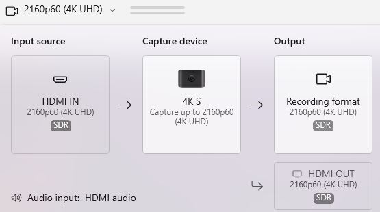

# Quartus-in-Docker with XRDP (Altera/Intel FPGA Image)

This project provides a ready-to-run Docker image for the **Altera Quartus** toolchain with a full desktop via **XRDP**, making it easy to run Quartus inside a container while still using the GUI.  
It also supports **USB FTDI/JTAG passthrough** for FPGA boards.

---

## 🧩 Prerequisites

- Docker installed and running on Linux.
- A valid **Quartus license file** (e.g., `LR-<#>_License.dat`).

## 🧱 Directory Layout

```
docker_AI/
├─ Dockerfile
├─ quartus.ini  (optional)
└─ License.dat  (Add your licence file HERE)
```

---

## 🚀 1. Pull the Base Image

```bash
docker pull alterafpga/fpgaaisuite-v2025.3:quartus
```

---

## 🧰 2. Copy Your License File

Place your license in the `docker_AI` folder, for example:

```
cp ~/lic/LR-238336_License.dat <GIT-REPO>/docker-AI/License.dat
```

If you use a different filename, update the `COPY` line in your `Dockerfile`.

---

## 🧱 3. Build the Modified Image

```bash
docker build -t altera-xrdp .
```

This installs XRDP + Xfce, adds your license, and sets up environment variables.

---
## 🧩 4. Run the Container (with USB FTDI Devices)

Use your device names from `/dev` (e.g., `/dev/ttyUSB0`–`/dev/ttyUSB3`):

```bash
docker run -d --name xrdp \
  -p 3389:3389 \
  --shm-size=2g \
  --net=host \
  --privileged \
  -v $HOME:/mnt/main_os \
  --device=/dev/ttyUSB0 \
  --device=/dev/ttyUSB1 \
  --device=/dev/ttyUSB2 \
  --device=/dev/ttyUSB3 \
  altera-xrdp
```

### Flag explanation

| Flag | Purpose |
|------|----------|
| `--net=host` | Makes networking and licensing work seamlessly |
| `--privileged` | Grants USB access for JTAG/FTDI |
| `--device=/dev/ttyUSB*` | Passes FPGA hardware interfaces |
| `--shm-size=2g` | Prevents GUI shared memory errors |
| `-v $HOME:/mnt/main_os` | Mounts your home directory inside the container |

---

## 🖥️ 5. Connect via Remote Desktop

Once running, connect using:

- **Windows**: Press `Win + R`, type `mstsc`, connect to `<linux_ip>`
- **Linux/macOS**: Use Remmina or FreeRDP:
  ```bash
  xfreerdp /u:dev /p:dev /v:localhost:3389
  ```

Default credentials:
```
Username: dev
Password: dev
```

---

## 6. DisplayPort Example Tutorial

TODO: link tutorials in subdirectories

---
After doing `docker run`, you can login into the XRDP session.


Open quartus through the terminal and begin a new project.


This example is specific for the Agilex 5 Modular Dev Board.


Select the DisplayPort IP in the IP directory.


Configure the IP for AXIS data format.


Configure the example project for the Agilex 5 Modular dev board.


Generate the example design project.


Compile the bistream for the example project.


Explore the Visual Designer to understand the IP used in the example project.


Program the Agilex 5 FPGA.


Configure the Host video output to 4k.


Verify the resolution and framerate on the output.


---


## 🧹 A. Common Commands

Stop & remove:
```bash
docker rm -f xrdp
```

Rebuild after changes:
```bash
docker build -t altera-xrdp .
```

View logs:
```bash
docker logs -f xrdp
```

Inspect devices:
```bash
docker exec -it xrdp bash -lc "lsusb && ls -l /dev/ttyUSB* 2>/dev/null || true"
```

---